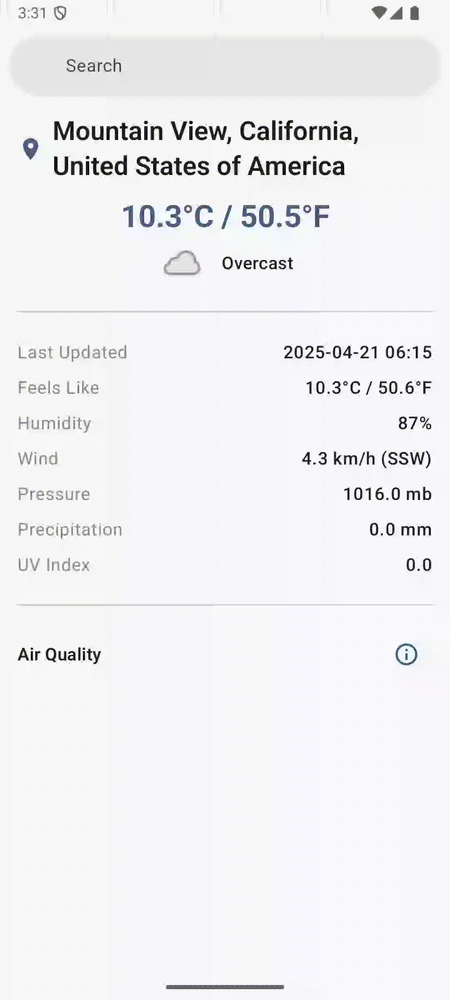

# Weather APP using Compose Multiplatform

  

**Weather APP** is a cross-platform application built using **Compose Multiplatform**. It allows you to check the weather and air quality of your current location or search for weather information in different cities.

## Key Features

*   **Current Location Weather:** Get weather details based on your current location.
*   **City Search:** Search for weather information by city name.
*   **Air Quality:** View air quality details.
*   **Detailed Location Info:** Get more information about the selected location.
* **Error Handling**
*   **Cross-Platform:** Built with Compose Multiplatform, it runs on both Android and iOS.

## Creation

- current app is created
  using [Compose-Multiplatform-Wizard](https://terrakok.github.io/Compose-Multiplatform-Wizard/)
- it should be same
  as [official compose Multiplatform Wizard](https://kmp.jetbrains.com/)
- but it has more features by providing useful libraries and plugins that you may need during development.
- For this APP, we selected IOS and Android platforms. You can find the main libraries and plugins in [libs.versions.toml](gradle/libs.versions.toml).

### Note

It's important to be aware that using a non-official library may involve risks in real projects. However, since this is a test project for learning purposes, it's acceptable to use.

## current app contains following feature

- Get current user location in first launch of the app

---

- Search for weather by location or by city name
  

- Show Air quality
  

- More details about location
  

- Handle error
  

### Note

The current app architecture consists of three layers: UI, data, and domain. This design was chosen because the project's business logic is relatively simple, involving only three screens and a single API call.

# Compose Multiplatform Application configurations

## Before running!
- check your system with [KDoctor](https://github.com/Kotlin/kdoctor)
- install JDK 17 or higher on your machine (JDK 21 recommended)
- add `local.properties` file to the project root and set a path to Android SDK there

### Android

To run the application on android device/emulator:

- open project in Android Studio and run imported android run configuration

To build the application bundle:

- run `./gradlew :composeApp:assembleDebug`
- find `.apk` file in `composeApp/build/outputs/apk/debug/composeApp-debug.apk`
  Run android UI tests on the connected device: `./gradlew :composeApp:connectedDebugAndroidTest`
## How to Contribute
Contributions are welcome! If you have ideas for improvements, bug fixes, or new features, please open an issue or submit a pull request.
### iOS

To run the application on iPhone device/simulator:

- Open `iosApp/iosApp.xcproject` in Xcode and run the standard configuration.
- Alternatively, use the [Kotlin Multiplatform Mobile plugin](https://plugins.jetbrains.com/plugin/14936-kotlin-multiplatform-mobile) for Android Studio.
- Run iOS simulator UI tests: `./gradlew :composeApp:iosSimulatorArm64Test`.

## Contact
If you have any questions or need further assistance, feel free to reach out: [https://www.linkedin.com/in/amged-mohamed-72b4a6189/](https://www.linkedin.com/in/amged-mohamed-72b4a6189/)

